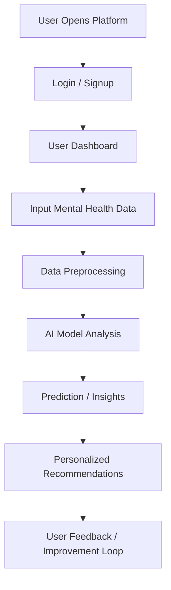

# 🧠 MentalCare Hub  
### *AI-Powered Mental Health Support Platform*

> A modern, intelligent platform designed to provide mental health assistance, emotional support, and personalized insights using AI-driven technologies.

---

## 🚀 Overview

**MentalCare Hub** is a comprehensive mental wellness platform that integrates **AI, user interaction, and data insights** to help individuals manage their mental health effectively.

The platform focuses on:
- Early mental health detection  
- Personalized support systems  
- User-friendly interaction  
- Scalable AI-driven architecture  

---

## ✨ Key Features

- 🤖 AI-Based Mental Health Assistance  
- 🧾 User Input & Emotional Analysis  
- 📊 Smart Recommendations System  
- 🔐 Secure Authentication System  
- 📈 Dashboard for Insights  
- 💬 Interactive Chat Support (Future Scope)  
- 🌐 Modern Responsive UI  

---

## 🏗️ Project Architecture

```
Mentalcare_Hub/
│
├── frontend/          # User Interface (React / HTML / CSS / JS)
├── backend/           # API & Server (FastAPI / Flask)
├── model/             # Machine Learning Models
├── data/              # Dataset & preprocessing
├── utils/             # Helper functions
├── static/            # Assets (images, styles)
├── templates/         # HTML templates
└── README.md
```

---

## 🔄 System Flowchart



---

## 🧠 How It Works

1. User logs into the system  
2. Provides mental health-related inputs  
3. Data is processed and cleaned  
4. AI model analyzes emotional patterns  
5. System generates insights and recommendations  
6. User receives guidance and support  

---

## 🛠️ Tech Stack

### Frontend
- HTML5, CSS3, JavaScript  
- React.js *(if used)*  

### Backend
- Python  
- FastAPI / Flask  

### Machine Learning
- Scikit-learn  
- Pandas, NumPy  

### Tools & Platforms
- Git & GitHub  
- VS Code  

---

## ⚙️ Installation & Setup

### 1️⃣ Clone Repository
```bash
git clone https://github.com/sp746711/Mentalcare_Hub.git
cd Mentalcare_Hub
```

### 2️⃣ Create Virtual Environment
```bash
python -m venv venv
venv\Scripts\activate   # Windows
```

### 3️⃣ Install Dependencies
```bash
pip install -r requirements.txt
```

### 4️⃣ Run Application
```bash
python app.py
```

---

## 📊 Future Enhancements

- 🧑‍⚕️ Integration with professional therapists  
- 📱 Mobile application  
- 💬 Real-time AI chatbot  
- 📈 Advanced deep learning models  
- 🌍 Multi-language support  

---

## 🤝 Contribution

Contributions are welcome!

```bash
Fork → Clone → Create Branch → Commit → Push → Pull Request
```

---

## 📜 License

This project is licensed under the **MIT License**.

---

## 👨‍💻 Author

**Sujan Pradhan**  
🎓 CSE-AI Student  
📌 Passionate about AI, Mental Health & Innovation  

---

## ⭐ Support

If you like this project, don’t forget to:

👉 Star the repository  
👉 Share with others  
👉 Contribute to improve it  

---

## 💡 Final Note

> *"Mental health is just as important as physical health — technology can bridge the gap."*# Mentalcare_Hub
